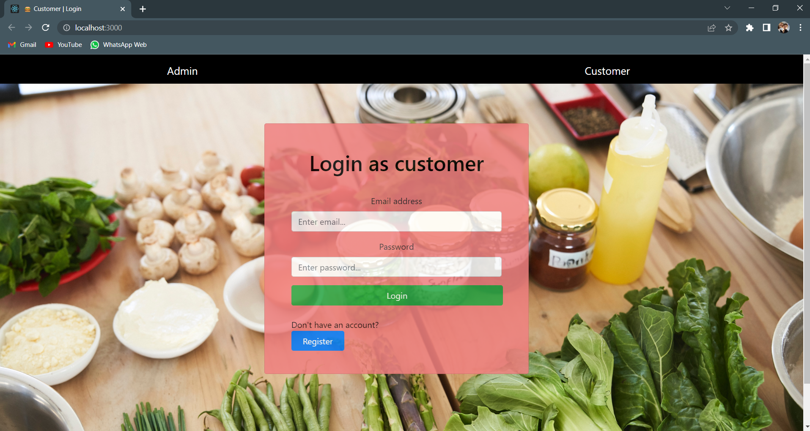
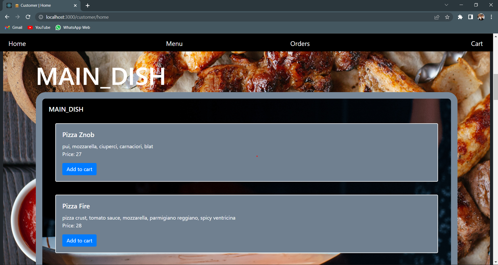
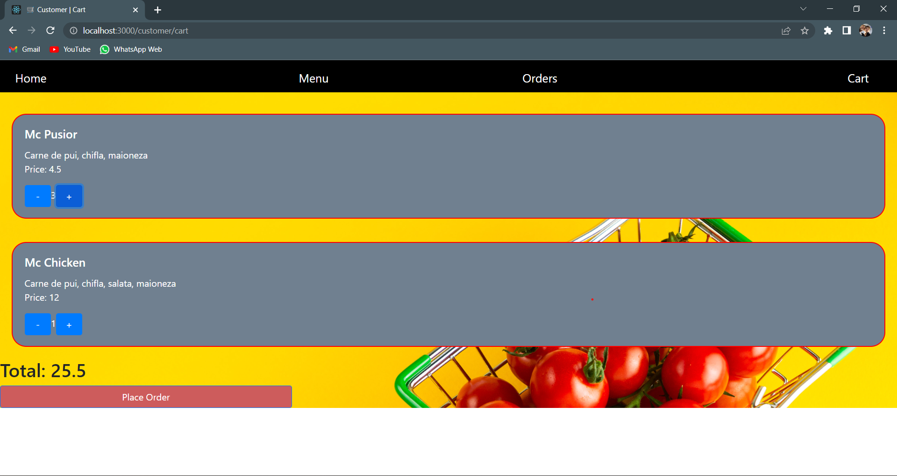
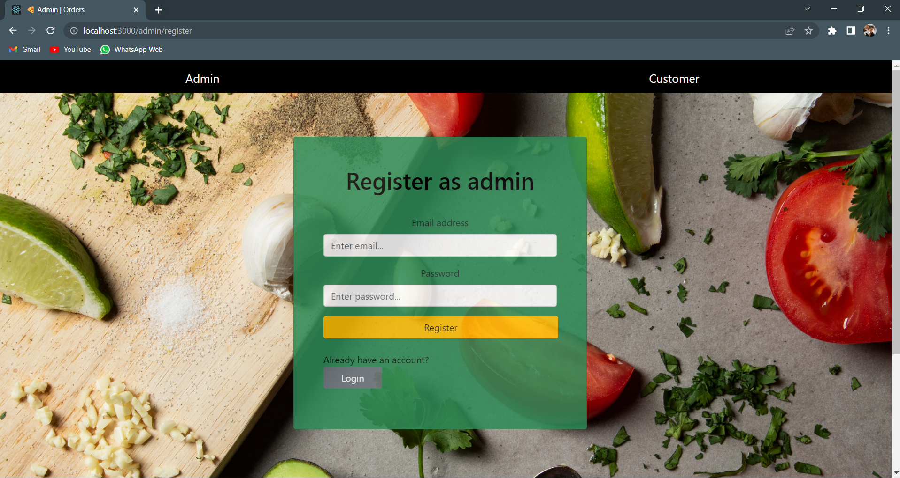
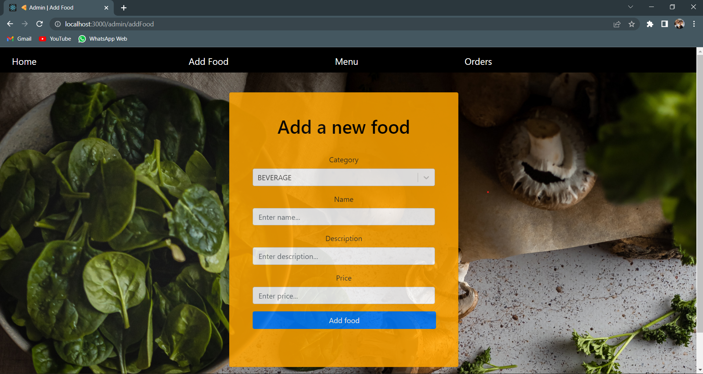
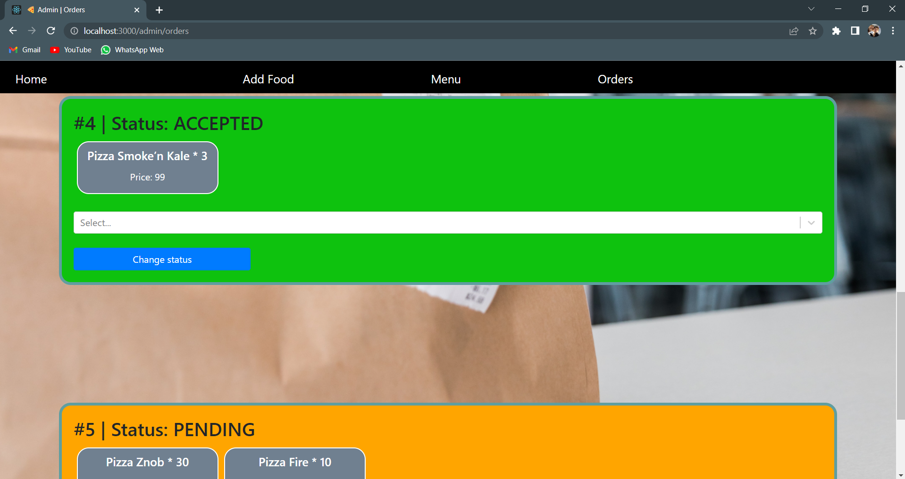

# 'Food-Panda' Web Application

# Description:
&nbsp;&nbsp;&nbsp;&nbsp;&nbsp;&nbsp;This project represents the 2nd assignment at the Software Design course during the 3rd Year - Computer Science - Technical University of Cluj-Napoca. It is a **food ordering web application** that accomodates two types of users: *Customer* and *Administrator*.


# Assignment requirements:
- The **Restaurant Administrator** should be able to:

    - log-in to the application
    - add restaurant to the application
    - information needed: name, location, available delivery zones
    - select category and add foods for each category
    - view menu (with all existing foods, separated into categories)
    - accept/decline order
    - view orders (with status)
    - filter orders by status
    - change status of order (in order)

- The **Customer** should be able to:
    - register into the application
    - password should be encoded in the database
    - log-in into the application
    - view restaurants
    - view menu for the selected restaurant
    - add foods to cart
    - place order
    - see status of the order
    - see history of all orders placed
    - search the restaurants by name

- **Technical** constraints:
    - **Client-Server application**(Web), written in **Java(Spring)** + **React** or **Angular**
    - Connectivity to relational database (**MySQL**)+ storage of data
    - Implement using **JPA Repository**
    - Implement using **Maven**
    - Implement the app using **Layered/MVC Architecture**
    - Validations of the inputs on specific flows(valid dates, non-negative values, unique username etc.)


# Implementation
## Backend
&nbsp;&nbsp;&nbsp;&nbsp;&nbsp;&nbsp; For the backend I had to use Java + Spring Boot, so I chose to use the **Layered Architecture** to easily fit the architecture of Spring Boot. Due to the usage of the **JPA Repository** interface, the management of the database and the transactions commited to it were the easiest to implement. The Models were mainly implemented using **Lombok**, so only the fields and the needed annotations can be found in the Model classes, below is an example of a model class:

### Model

```java
@Entity
@Data
@AllArgsConstructor
@NoArgsConstructor
@RequiredArgsConstructor
@Builder
public class Customer {

    @Id
    @GeneratedValue(strategy = GenerationType.IDENTITY, generator = "customer_generator")
    private Long customerId;

    @NonNull
    @Column(unique = true)
    private String email;

    @NonNull
    private String password;

    @NonNull
    @Column
    private String name;

    @NonNull
    private String address;

    @OneToOne
    private Zone addressZone;

    @OneToMany(mappedBy = "customer")
    private List<PandaOrder> pandaOrders;
}
```

### Data Layer
&nbsp;&nbsp;&nbsp;&nbsp;&nbsp;&nbsp; The data layer is represented, as stated above, from the **Repository** package, which is a collection of interfaces which implements JPA Repository. In this waym the repositories are *ready-to-use* and if any customer query was needed, only the declaration of the method was enough for Spring-Boot to create the implementation.
```java
@Repository
public interface CustomerRepository extends JpaRepository<Customer, Long> {

    Optional<Customer> findById(Long idAccount);

    Optional<Customer> findByEmail(String email);

}

```


### Business/Service Layer
&nbsp;&nbsp;&nbsp;&nbsp;&nbsp;&nbsp; The Service layer was the hardest to implement, as it required the most of my implementation, which, in this context, means **validation**, **data-coupling** and **database transactions**. In order to follow the general and recommended use of the Spring-Boot architecture, the Service Layer was divided into two sub-components:
- **Service**
- **Implementation**

The role of this division would be reflected when a certain component would have a different implementation of the same service (e.g. A special type of user might have different functionalities from another one, so the service might have the same defined methods, but the implementation could be different.)


#### Service
&nbsp;&nbsp;&nbsp;&nbsp;&nbsp;&nbsp; In the **Service** package there we can find only the interfaces that the Implementations would have to, well, 'implement'. The Service interfaces simply have a little more lines of code than the Repository ones, due to the fact that here we also declare the methods that we will later implement.

```java
@Service
public interface CustomerService {

    Customer save(Customer customer);

    Customer authenticate(AccountDTO accountDTO);

    PandaOrder placeOrder(Long restaurantId, Long customerId, PandaOrder order);

    List<PandaOrder> fetchOrdersForCustomer(Long customerId);
}
```

#### Implementation
&nbsp;&nbsp;&nbsp;&nbsp;&nbsp;&nbsp; This is where the hard work can be seen. All Implementation classes *implement* the Service and define the functionality of every method declared in them. In these classes we can also find references to the **Repository** interfaces that we talked about earlier(Note that they are referenced with the **@Autowired** annotation that Spring-Boot provides. We will talk about each functionality of these classes:
```java
public class CustomerServiceImpl implements CustomerService {  
  
    @Autowired  
  CustomerRepository customerRepository;
   
   ...

}
```

##### Validation
&nbsp;&nbsp;&nbsp;&nbsp;&nbsp;&nbsp; The exceptions are handled with a Handler that is annotated with **@ControllerAdvice**, another helpful annotation of Spring-Boot framework. This class will catch any exception thrown in our Service Layer and return to the request caller a **ResponseEntity** with a special **APIError** class that has the following model.

```java
@Getter
public class APIError {

    private final HttpStatus status;
    @JsonFormat(shape = JsonFormat.Shape.STRING, pattern = "dd-MM-yyyy hh:mm:ss")
    private final LocalDateTime timestamp;
    private final String message;
    private final String path;

    public APIError(HttpStatus status, Throwable exception, WebRequest request) {
        this.status = status;
        this.message = exception.getMessage();
        this.timestamp = LocalDateTime.now();
        String reqString = request.toString();
        this.path = reqString.substring(reqString.indexOf("/"), reqString.indexOf(";"));
    }
}
```

In this way, the handling of a Bad Request is done in the backend and the error message cand be customized by the developer. Below it is found a usage of this error handling, when a Customer wants to register.

```java
@Override
    public Customer save(Customer customer) {
       if (!validator.isEmailValid(customer.getEmail()))
            throw new InvalidInputException("Email is not valid! It should be a valid email(eg. foodpanda@glovo.com");
        if (!validator.isPasswordValid(customer.getPassword()))
            throw new InvalidInputException("Password does not meet the requirements\n-At least 8 characters long\n-At least a digit\nAt least a letter");
        if (customer.getName().isEmpty())
            throw new InvalidInputException("Customer {email} must not be null");
        if (customer.getAddress().isEmpty())
            throw new InvalidInputException("Customer {email} must not be null");

       ....

}
```
<br/>
<br/>

##### Data-Coupling
&nbsp;&nbsp;&nbsp;&nbsp;&nbsp;&nbsp; In this step we pre-process the entities before saving them to the database using the repositories. For example, the **PandaOrder** entity has a reference to a **Customer** and to a **Restaurant** that have to be linked to the *order reference* before saving it to the database. In the example below, we have to retrieve the customer and restauranta instance before creating a new order using the *Builder* design pattern.

```java
@Override  
public PandaOrder placeOrder(Long restaurantId, Long customerId, PandaOrder order) {

	...
	
	Customer _customer = customerRepository.findById(customerId).orElseThrow(  
        () -> new InvalidInputException("No customer found for customerId=" + customerId)  
	);  
  
	Restaurant _restaurant = restaurantRepository.findById(restaurantId).orElseThrow(  
        () -> new InvalidInputException("No restaurant found for restaurantId=" + restaurantId)  
	);    
  
	PandaOrder _pandaOrder = pandaOrderRepository.save(  
        PandaOrder  
                .builder()  
                .customer(_customer)  //Data-coupling here
                .products(order.getProducts())  
                .restaurant(_restaurant)  //Data-coupling here
                .state(_pendingState)  
                .restaurantName(_restaurant.getName())  
                .build()  
	);
	
	...
}
```
In this way, the instances in the database will be linked by saving the entity with the foreign keys correctly attached. The next time we will be fetching this entity from the database, it will already have the references to the *customer* and *restaurant* with all their fields.

##### Database transactions
&nbsp;&nbsp;&nbsp;&nbsp;&nbsp;&nbsp; In the example above we've already seen some transactions to the database. Basically, any call to a method from a *Repository* is a transaction to the database.

```java
Customer _customer = customerRepository.save(  
        Customer  
                .builder()  
                .name(customer.getName())  
                .address(customer.getAddress())  
                .email(customer.getEmail())  
                .password(BCrypt.hashpw(customer.getPassword(), BCrypt.gensalt()))  
                .addressZone(customer.getAddressZone())  
                .build()  
);
```
<br/>
<br/>

### Presentation Layer (Controller)
&nbsp;&nbsp;&nbsp;&nbsp;&nbsp;&nbsp; This layer is also relatively simple due to the fact that validation and error handling is done in the *Business Layer* and so, in the Presentation Layer we only have a bunch of **@RestMapping**s that provide endpoints for our frontend to send requests to. In other words, for every important functionality from the Business Layer, there is a corresponding method in the controller which calls it using a reference to a *Implementation* class.

```java
@RestController  
@RequestMapping("customer")  
public class CustomerController {  
  
    @Autowired  
  CustomerServiceImpl customerServiceImpl;  
  
  
  @PostMapping("register")  
    public ResponseEntity<Customer> register(@RequestBody(required = false) Customer customer) {  
        return new ResponseEntity<>(customerServiceImpl.save(customer), HttpStatus.CREATED);  
  }  
  
    @PostMapping("auth")  
    public ResponseEntity<Customer> authenticate(@RequestBody(required = false) AccountDTO accountDTO) {  
        return new ResponseEntity<>(customerServiceImpl.authenticate(accountDTO), HttpStatus.OK);  
  }
  
  ...

}
```

<br/>
<br/>

## Frontend
&nbsp;&nbsp;&nbsp;&nbsp;&nbsp;&nbsp; For the frontend part, I have used **ReactJs** and this was my first project with any JavaScript language, so bear with me. I preffered Hooks over Components, as they were easier to understand and implement and I have also used *react-router-dom* to **navigate** between pages. In order to send request to the backend, I have used **axios** due to its error handling implementation.

&nbsp;&nbsp;&nbsp;&nbsp;&nbsp;&nbsp; I have divided the frontend into two packages: **api**, and **pages**, the latter being composed by **customer** and **admin** pages.

### API
&nbsp;&nbsp;&nbsp;&nbsp;&nbsp;&nbsp; In the api package we have two javascript files: **customerAPI** and **adminAPI** which both implement several *async* functions that we call from our pages. Basically, the functions from these files send requests to our backend and returns the response to the frontend in order to use it. For example, below we have the function which sends the *Login* request to the backend. The functions are relatively simple, and they do only a simple thing: send requests.
```js
async function sendLogin(accountDTO) {  
    const response = await axios(  
        {  
	          method: 'POST',  
			  url: path + 'auth',  
			  headers: {  
                  'Content-Type': 'application/json',  
				  'Accept': 'application/json'  
			  },  
			  data: JSON.stringify(accountDTO)  
		});  
	 return await response.data;  
}
```
<br/>
<br/>

### Pages
&nbsp;&nbsp;&nbsp;&nbsp;&nbsp;&nbsp; Here we have all the html pages that will be seen in the browser. As stated above, I have used hooks in order to manage the state of our variables and also *localStorage* to send data between pages. They call methods from the **api** package and handle the user interaction using javascript and html components like *input*, *select* and *buttons*. The styling was done using *CSS* and *Bootstrap* and below is a simple implementation of the login page using *Forms*.

```js
<Form onSubmit={handleSubmit}>  
	 <Form.Group className={'mb-3'}>  
	 <Form.Label>Email address</Form.Label>  
	 <Form.Control  name={'credential'}  
		            type={'email'}  
		            placeholder={'Enter email...'}  
		            onChange={handleChange}/>  
	 </Form.Group>  
	 
	 <Form.Group className={'mb-3'}>  
	 <Form.Label>Password</Form.Label>  
	 <Form.Control  name={'password'}  
	            type={'password'}  
	            placeholder={'Enter password...'}  
	            onChange={handleChange}/>  
	 </Form.Group> 
  
	 <Button variant="success" type="submit">  
		  Login  
	 </Button>  
</Form>
```

The **handleChange** function from above uses the event that was generated in order to change the value of our *accountDTO* variable using some form of javascript reflection.

```js
function handleChange(event) {  
    const {name, value} = event.target  
  setAccountDTO(prevState => {  
        return {  
            ...prevState,  
  [name]: value  
        };  
  })  
}
```

<br/>

# Visuals
&nbsp;&nbsp;&nbsp;&nbsp;&nbsp;&nbsp; Because in web and mobile development the UI/UX is very important, I have taken some time into styling my application, so below you can find some screenshots of the app.

### Customer Login

### Customer Menu

### Customer Cart

### Admin Register

### Admin Add Food

### Admin Orders



# Further Implementation
&nbsp;&nbsp;&nbsp;&nbsp;&nbsp;&nbsp; A further implementation would consist in including a mail management system to our application and also send mails with notifications about orders. Also, paying and rewards can also improve the application by making it more realistic and user-friendly. Adding images for every food an administrator can add would also be a great improvement.

<br/>
<br/>
